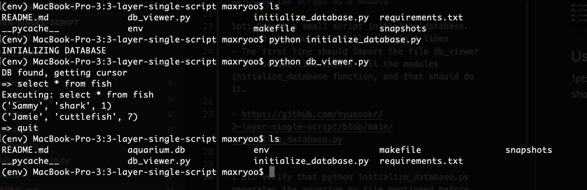

# 3-layer-single-script


## Set Up

1pt: Create a new github public repo (you'll send in the link) and call it '3-layer-single-script'
- https://github.com/hyunsukr/3-layer-single-script

1pt: Create a requirements.txt file with 'pytest' in it
- https://github.com/hyunsukr/3-layer-single-script/blob/main/requirements.txt

1pt: Create a .gitignore file in your repo and add env in the file (this will keep our environment from getting checked into github.
- https://github.com/hyunsukr/3-layer-single-script/blob/main/.gitignore


## Check Point
1pt: At this point you should also be able to run pytest -vvx db_viewer.py and see green come through the console for the passing tests.


## Using the script as a module

1pt: Create a small script initialize_database.py, and it should literally contain 2 lines
- The first line should import the file db_viewer
- The second line should call the modules initialize_database function, and that should do it.

- https://github.com/hyunsukr/3-layer-single-script/blob/main/initialize_database.py


1 pt: Verify that python initialize_database.py generates the aquarium.py file mentioned before. If it does, now try running the main script python db_viewer.py and you should see a new message, DB found, getting cursor. If you now type select * from fish; at the cursor and enter, you should see two lines show up with names and two types of fish.




## Setting up the Makefile

1 pt: Add a file named makefile to your project.

- https://github.com/hyunsukr/3-layer-single-script/blob/main/makefile


1 pt: And that's it, a make clean_view should run the clean, init and then view for you.


## Using a pytest fixture
2 pt: Use a pytest fixture to provide the data used to create the test database (The CREATE TABLE... INSERT INTO... INSERT INTO... lines)

```@pytest.fixture
def setup_database():
    conn = sqlite3.connect(':memory:')
    cursor = conn.cursor()
    cursor.execute('''
	    CREATE TABLE fish (name TEXT, species TEXT, tank_number INTEGER)
        ''')
    sample_data = [
        ('Sammy', 'shark', 1),
        ('Jamie', 'cuttlefish', 7),
    ]
    cursor.executemany('INSERT INTO fish VALUES(?, ?, ?)', sample_data)
    yield conn

def test_pytest_fixture_setup(setup_database):
    conn = setup_database
    assert len(list(conn.execute('SELECT * FROM fish'))) == 2

```

For readability purposes
- https://github.com/hyunsukr/3-layer-single-script/blob/main/db_viewer.py#L103-L119


3 pt: As mentioned earlier, there is a bug here. If we run the tests, they leave the test intantiation of aquarium.db behind. Fix the bug and make sure all your tests still pass.

- Running tests removes the db file.
- https://github.com/hyunsukr/3-layer-single-script/blob/main/db_viewer.py#L101